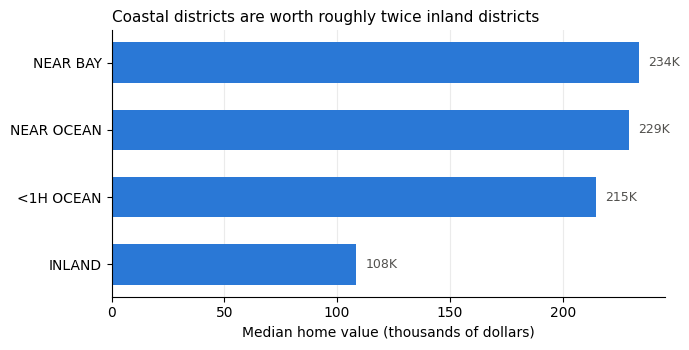
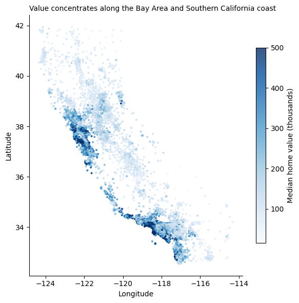

# California Housing Market Analysis with SQL

End-to-end SQL analysis of 20,640 California census districts (1990 Census housing data), written in **DuckDB SQL** and run from Python in Google Colab.

**Notebook:** [`california_housing_sql.ipynb`](california_housing_sql.ipynb)

## Questions answered
1. How clean is the data, and what are its limits?
2. How do home values differ by location (distance to the ocean)?
3. How strongly does household income drive home value?
4. Which districts are the most expensive in each market, and where does a district rank statewide?
5. Which districts look overcrowded (many people per room)?

## SQL skills shown
`SELECT` / `WHERE` / `ORDER BY` · aggregates and `GROUP BY` · `CASE` expressions · conditional aggregation · `LEFT JOIN` anti-join checks · CTEs (`WITH`) · window functions (`ROW_NUMBER`, `PERCENT_RANK`) · `quantile_cont`

## Key findings
- **Data quality:** 965 districts (4.7%) are capped at the $500,001 maximum value, and 207 are missing bedroom counts. Both are flagged rather than silently dropped.
- **Location matters most:** inland districts have a median home value of **$108,500**, compared with **$214,850–$233,800** for the coastal categories.
- **Income is the strongest single driver:** correlation between median income and home value is **0.688**. Coastal household income runs about 30% higher than inland.
- **The cap hides the top of the market:** 441 of the 691 highest-income districts sit at the value cap, so true prices there are understated.
- **Overcrowding screen:** districts above the 99th percentile of people per room were flagged; the inland flagged districts average **17.3 people per room**, a strong sign of group quarters or data anomalies.

## How to run
Open the notebook in Google Colab and choose **Runtime → Run all**. The dataset loads straight from a public URL, so no setup is needed.

## Tools
Python · DuckDB · pandas · matplotlib · Google Colab

**Data:** California Housing dataset (Pace & Barry, 1997), via Aurélien Géron's *Hands-On Machine Learning* repository.
